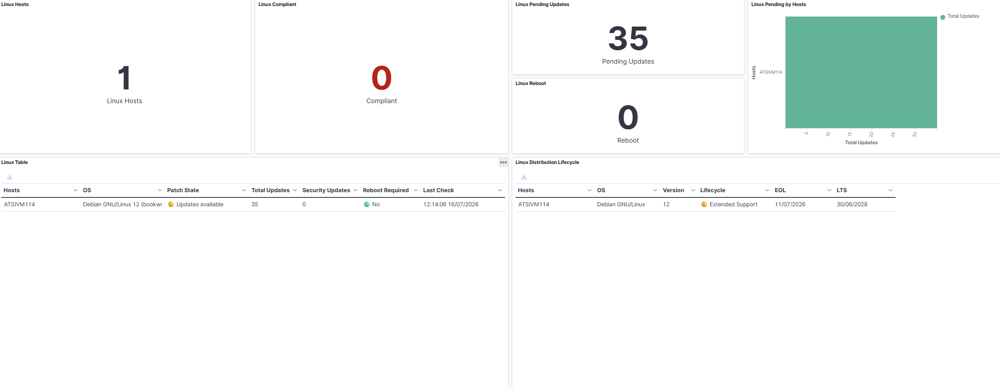
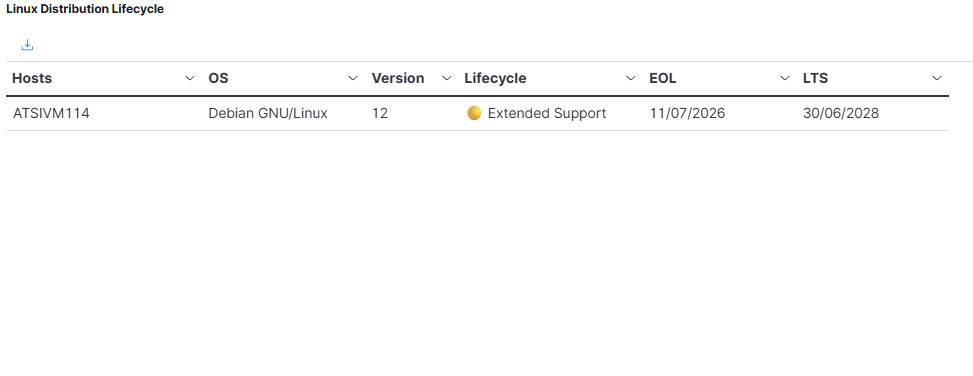

# Wazuh Linux Patch Monitor

Linux patch management and lifecycle monitoring for Wazuh.



## Features

- 🔒 Detect security updates
- 📦 Detect pending updates
- 🔄 Detect reboot required
- 🖥️ Linux distribution lifecycle monitoring
- 📅 End Of Life monitoring
- 🟡 Extended Support detection
- 📊 Ready-to-import OpenSearch dashboards
- ⚡ Pure Bash implementation
- 🛠 Automatic EOL cache update

---

## Supported distributions

| Distribution | Supported |
|--------------|-----------|
| Debian | ✅ |
| Ubuntu | ✅ |
| Rocky Linux | ✅ |
| AlmaLinux | ✅ |
| CentOS | ✅ |
| RHEL | ✅ |

---

## Dashboard

### Overview


### Patch Compliance


### Distribution Lifecycle



---

## Repository structure

```
scripts/
dashboards/
docs/
screenshots/
wazuh/
```

---

## Installation

```bash
git clone https://github.com/Hukago7/wazuh-linux-patch-monitor.git

cd wazuh-linux-patch-monitor

chmod +x install.sh

sudo ./install.sh
```

---

## Components

### Scripts

- wazuh_linux_patch_status.sh
- update_linux_eol_cache.sh

### Wazuh

- local_rules.xml
- local_decoder.xml
- ossec.conf.example

### Dashboards

Ready to import into OpenSearch Dashboards.

---

## Generated information

The integration reports:

- Operating system
- Distribution version
- Kernel version
- Pending updates
- Security updates
- Reboot status
- Distribution lifecycle
- End Of Life
- Extended Support
- Severity
- Last check

---

## Example

| Host | OS | Lifecycle | Patch State |
|------|----|-----------|-------------|
| ATSIVM114 | Debian 12 | 🟢 Supported | 🔴 Security Updates |

---

## License

MIT